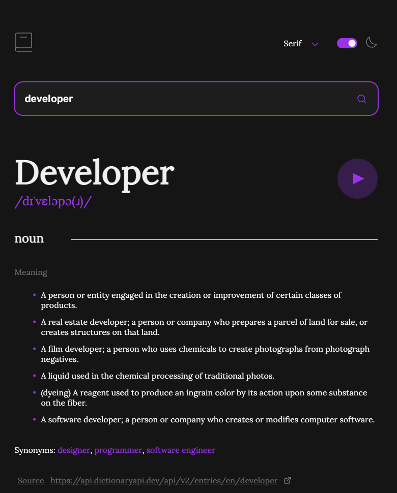

# Frontend Mentor - Dictionary web app solution

This is a solution to the [Dictionary web app challenge on Frontend Mentor](https://www.frontendmentor.io/challenges/dictionary-web-app-h5wwnyuKFL). Frontend Mentor challenges help you improve your coding skills by building realistic projects. 

## Table of contents

- [Overview](#overview)
  - [The challenge](#the-challenge)
  - [Screenshot](#screenshot)
  - [Links](#links)
- [My process](#my-process)
  - [Built with](#built-with)
  - [What I learned](#what-i-learned)
  - [Continued development](#continued-development)
  - [Useful resources](#useful-resources)
- [Author](#author)


## Overview

### The challenge

Users should be able to:

- Search for words using the input field✅
- See the Free Dictionary API's response for the searched word✅
- See a form validation message when trying to submit a blank form✅
- Play the audio file for a word when it's available✅
- Switch between serif, sans serif, and monospace fonts✅
- Switch between light and dark themes✅
- View the optimal layout for the interface depending on their device's screen size✅
- See hover and focus states for all interactive elements on the page✅
- **Bonus**: Have the correct color scheme chosen for them based on their computer preferences. ✅

### Screenshot



### Links

- Solution URL: [Click here](https://github.com/MarkosComK/dictionary-web-app)
- Live Site URL: [Click here](https://markoscomk.github.io/dictionary-web-app/)

## My process

### Built with

- Semantic HTML5 markup
- CSS custom properties
- CSS Animations
- Flexbox


### What I learned

I really improved my usage of data received from an api. Think it would be better do this project with an framework (Angular or React). Inner the data in the html doesn´t feel "comfortable" without use something like React.


#

### Useful snippet to set the theme

```js
let dark = false


const darkThemeMq = window.matchMedia("(prefers-color-scheme: dark)");
if (darkThemeMq.matches) {
    setDarkTheme()
} else {
    setLightTheme()
}

themeButton.addEventListener("click" , (e) => {
    dark = !dark
    if(themeCircle.classList.contains("theme-button-switch")){
        setLightTheme()
    } else {
        setDarkTheme()
    }
})
```


### Continued development

Ill build some app like this one but using a framework not just to improve my abillities but also see how feels the same project (or similar) in a lib like React


### Useful resources

- [Theme CSS resource](https://css-tricks.com/a-complete-guide-to-dark-mode-on-the-web/) - This really help me to build an good method to set dark/light theme
- [Js inserting commas in html](https://stackoverflow.com/questions/55518050/array-of-strings-adding-commas-when-inserted-into-html) - I got a hard-solve issue when putting the data on the html and this help me a lot to understand arrays and why this problem is happening to me

## Author

- linkedin - [@MarkosComK](https://www.linkedin.com/in/markos-soares/)
- Github - [MarkosComK](https://github.com/MarkosComK)
- Frontend Mentor - [@MarkosComK](https://www.frontendmentor.io/profile/MarkosComK)
- instagram - [@MarkosComK](https://www.instagram.com/markoscomk/)

## Final considerations

If you want to give me some feedback, tip, or just talk to me, feel free to contact me through any of my social medias.

"Tudo acontece por uma razão e esta existe para me[/te] ajudar." 😎

<br>

<div>
  <a href="https://www.linkedin.com/in/markos-soares/">
    
  </a> 
  <a href="https://instagram.com/MarkosComK" target="_blank"></a>
  <a href="https://twitter.com/markoscomk" target="_blank"></a>
 <a href = "mailto:markoscomks@gmail.com"></a>
</div>

<br>